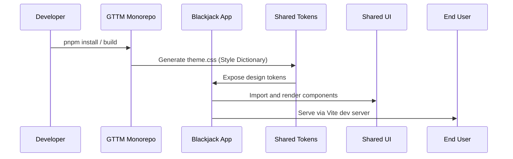

# 🏗️ GTTM Hub — Technical Architecture

**Full Name:** Gaming Training Tech & Mastery Hub  
**Acronym:** GTTM (“Get ’Em”)  
**Purpose:** A modular, scalable monorepo enabling immersive training through interactive games, visual systems, and presentation tools.

---

## 1. Overview

GTTM Hub is a **TypeScript + React + Vite + TailwindCSS v4 monorepo**, designed for cross-domain reuse and rapid iteration.

It integrates:
- **Shared UI components** (ShadCN-based)
- **Design tokens → Style Dictionary → CSS Variables**
- **Tailwind preset** for unified theming
- **Multiple Vite apps** (Blackjack, Presentation, Systems)
- **Utilities & hooks** for logic and data flow

The repository follows a **modular monorepo pattern**:

```

gttm-hub/
├── apps/
│   ├── blackjack/
│   ├── presentation/
│   └── systems/
│
├── packages/
│   ├── shared-tokens/
│   ├── tailwind-preset/
│   ├── shared-ui/
│   └── shared-utils/
│
├── docs/
│   └── modules/
│
├── pnpm-workspace.yaml
└── package.json

````

---

## 2. Architectural Layers

| Layer | Folder | Description | Example |
|--------|---------|-------------|----------|
| **App Layer** | `/apps/*` | Standalone Vite + React applications consuming shared packages. | `apps/blackjack/src/App.tsx` |
| **UI Layer** | `/packages/shared-ui` | Shared ShadCN-style UI components that reflect the tokenized design system. | `Button`, `Card`, `Navbar` |
| **Design Layer** | `/packages/shared-tokens` | Source of truth for all design decisions (colors, spacing, typography). Built with **Style Dictionary** into CSS vars. | `theme.css`, `tokens.json` |
| **Theming Layer** | `/packages/tailwind-preset` | TailwindCSS preset that maps tokens into Tailwind’s theme. | `index.js` exports `preset` |
| **Logic Layer** | `/packages/shared-utils` | Reusable hooks and helper functions shared across apps. | `useLocalStorage`, `formatTime` |
| **Documentation Layer** | `/docs/modules` | Markdown docs for onboarding, style, architecture, and workflows. | `technical-architecture.md` |

---

## 3. Core Data Flow

```mermaid
flowchart TD
    A[Design Tokens - tokens.json] --> B[Style Dictionary Build]
    B --> C[theme.css - CSS Variables]
    C --> D[Tailwind Preset - maps tokens to theme]
    D --> E[Apps - consume Tailwind + shared-ui]
    E --> F[User Experience Layer]
````

**Flow Summary:**

1. Tokens define *visual constants*.
2. Style Dictionary compiles them into CSS variables.
3. Tailwind preset imports those variables as theme values.
4. Shared UI components consume these tokens.
5. Apps import the preset and components for a unified design.

---

## 4. Dependency Graph (Conceptual)

```mermaid
graph LR
    subgraph Shared_Packages
        Tokens["@getem/shared-tokens"]
        Preset["@getem/tailwind-preset"]
        UI["@getem/shared-ui"]
        Utils["@getem/shared-utils"]
    end

    subgraph Apps
        Blackjack["apps/blackjack"]
        Presentation["apps/presentation"]
        Systems["apps/systems"]
    end

    Tokens --> Preset
    Tokens --> UI
    Preset --> Apps
    UI --> Apps
    Utils --> Apps
```

---

## 5. Build + Toolchain

| Tool                      | Purpose                                      |
| ------------------------- | -------------------------------------------- |
| **PNPM**                  | Workspace + dependency management            |
| **Vite**                  | Lightning-fast app bundling                  |
| **React 19 + TypeScript** | Component framework                          |
| **TailwindCSS v4**        | Utility-first styling with token integration |
| **Style Dictionary**      | Token transformation → CSS Variables         |
| **ESLint / Prettier**     | Linting and formatting                       |
| **ShadCN/UI**             | Accessible, composable component patterns    |

---

## 6. App Lifecycle Example



---

## 7. Extensibility

* Add new app → `apps/new-app`
* Add new design token → `packages/shared-tokens/tokens.json` → rebuild
* Add new shared component → `packages/shared-ui/`
* Extend theme → edit `packages/tailwind-preset/index.js`

---

## 8. Future Integrations (Planned)

* **Supabase** for multiplayer data sync
* **Framer Motion** for micro-interactions
* **Turborepo or Nx** for parallel builds
* **GitHub Copilot for Teams** with repo-awareness (see Copilot.md)
* **Automated docs generation** from token metadata

---

## 9. References

* [TailwindCSS v4 Documentation](https://tailwindcss.com/docs)
* [Style Dictionary Docs](https://styledictionary.com)
* [ShadCN UI](https://ui.shadcn.com/)
* [Vite Documentation](https://vitejs.dev/)

---

📘 **Maintainer:** Vincent Radford
🕒 **Last Updated:** 2025-10-12
📍 **Location:** `/docs/modules/technical-architecture.md`

---