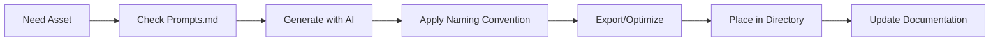

# GTTM Hub - Asset Generation Workflow

> Purpose: Step-by-step guide for generating, naming, and organizing brand assets using AI tools and the GTTM brand system.
> 

> Last Updated: 2025-10-14
> 

---

## 🎯 Quick Start Workflow



---

## 📋 Step-by-Step Process

### Step 1: Identify Asset Need

**Ask yourself:**

- What type of asset do I need? (logo, icon, social, etc.)
- What's the primary use case? (web, print, social media)
- What size/format is required?
- What variant/style matches the context?

**Example:**

> "I need a Twitter card to announce our new blackjack feature"
> 

---

### Step 2: Find the Right Prompt

**Location:** `docs/branding/prompts.md`

**Navigate to the relevant section:**

- Logo Explorations
- Moodboards
- Cover Art / Hero Imagery
- UI Mockups
- Extended Creative
- Product-Specific

**For our example:** Go to "Cover Art / Hero Imagery" section

---

### Step 3: Copy and Customize Prompt

**Base Prompt (from prompts.md):**

```
Dynamic cover art for Get 'Em: bold electric indigo background,
aqua mint energy streaks, crimson rose highlights. Style: esports
poster meets synthwave album cover.

```

**Customized for Twitter:**

```
Twitter card (1200x628) for Get 'Em blackjack announcement: bold
electric indigo (#5A4BFF) background, aqua mint (#00E6A8) playing
card highlights, "Now Live: Blackjack Trainer" text in white,
minimalist flat design, high contrast for readability.

```

---

### Step 4: Generate with AI Tool

**Midjourney Example:**

```
/imagine Dynamic cover art for Get 'Em: bold electric indigo background,
aqua mint energy streaks, crimson rose highlights. Style: esports poster
meets synthwave album cover --ar 16:9 --v 6

```

**DALL·E Example:**
Paste the customized prompt directly into DALL·E interface, specify:

- Size: 1792 x 1024 (closest to 1200x628)
- Style: Flat design, high contrast

**Claude Example:**

- Use for refining prompts or generating text-based designs
- Create mockups in HTML/SVG for exact specifications

---

### Step 5: Apply Naming Convention

**Reference:** `docs/branding/asset-naming-convention.md`

**For our Twitter card example:**

**Pattern:**

```
gttm-social-[platform]-[type]-[descriptor]-[date].[ext]

```

**Applied:**

```
gttm-social-twitter-card-blackjack-launch-20251014.png

```

**Breakdown:**

- `gttm` = Project prefix
- `social` = Category
- `twitter` = Platform
- `card` = Asset type
- `blackjack-launch` = Descriptor
- `20251014` = Date (YYYYMMDD)
- `.png` = Format

---

### Step 6: Export and Optimize

**Export Settings:**

**For Web (Social Media):**

```
Format: PNG or WEBP
Resolution: Exact platform specs
Color: RGB
Quality: 80-90%

```

**For Logos/Icons:**

```
Format: SVG (primary), PNG (fallback)
SVG: Optimize with SVGO
PNG: Export @1x, @2x, @3x

```

**For Print:**

```
Format: PDF or PNG
Resolution: 300 DPI
Color: CMYK (for professional print)
Quality: 100%

```

**Optimization Tools:**

- **TinyPNG**: PNG compression
- **SVGOMG**: SVG optimization
- **Squoosh**: Modern image compression
- **ImageOptim**: Batch optimization (Mac)

---

### Step 7: Place in Directory Structure

**Location:** Based on `assets/` directory structure

**For our example:**

```
assets/
└── social/
    └── twitter/
        └── gttm-social-twitter-card-blackjack-launch-20251014.png

```

**Include variants if needed:**

```
assets/
└── social/
    └── twitter/
        ├── gttm-social-twitter-card-blackjack-launch-20251014.png
        ├── gttm-social-twitter-card-blackjack-launch-20251014.webp
        └── gttm-social-twitter-card-blackjack-launch-20251014@2x.png

```

---

### Step 8: Update Documentation

**Add to `assets/README.md`:**

```markdown
## Recent Additions

### 2025-10-14
- Added Twitter card for blackjack launch announcement
  - File: `social/twitter/gttm-social-twitter-card-blackjack-launch-20251014.png`
  - Size: 1200x628
  - Usage: Twitter/X post announcing blackjack trainer feature

```

**Update asset inventory:**

```markdown
## Social Media Assets

### Twitter/X
- Blackjack Launch Card (2025-10-14)
- [Future cards...]

```

---

## 🎨 Asset Type Specific Workflows

### Logo Generation Workflow

1. **Choose logo type** (wordmark, icon, badge, etc.)
2. **Select prompt** from "Logo Explorations" section
3. **Generate** with Midjourney or design in Figma
4. **Export as SVG** (primary) and PNG variants
5. **Name** using: `gttm-logo-[type]-[variant].[ext]`
6. **Place in** `assets/brand/logos/`
7. **Create variants:**
    - Primary color (#5A4BFF)
    - White (for dark backgrounds)
    - Dark (for light backgrounds)
    - Monochrome

**Example output:**

```
assets/brand/logos/
├── gttm-logo-wordmark-primary.svg
├── gttm-logo-wordmark-white.svg
├── gttm-logo-wordmark-dark.svg
├── gttm-logo-wordmark-primary-512.png
└── gttm-logo-wordmark-primary-512@2x.png

```

---

### Icon Generation Workflow

1. **Identify icon need** (UI action, status, navigation)
2. **Check existing icons** in `assets/ui/icons/`
3. **If new, use prompt** from "Extended Creative - Icon Set Design"
4. **Generate as SVG** (24x24 base size)
5. **Apply semantic colors:**
    - Primary: #5A4BFF (brand actions)
    - Accent: #00E6A8 (success, positive)
    - Peach: #FFCAB1 (warning)
    - Crimson: #E05263 (error, danger)
6. **Name** using: `gttm-icon-[name]-[variant]-[size].svg`
7. **Export raster versions** for specific platforms

**Example:**

```
gttm-icon-success-circle-24.svg
gttm-icon-error-circle-24.svg
gttm-icon-warning-circle-24.svg

```

---

### Social Media Asset Workflow

1. **Check platform requirements:**
    - Instagram Post: 1080x1080
    - Instagram Story: 1080x1920
    - Twitter Card: 1200x628
    - LinkedIn Banner: 1584x396
    - YouTube Thumbnail: 1280x720
2. **Use or customize prompt** from "Cover Art / Hero Imagery"
3. **Generate with correct aspect ratio:**
    - Midjourney: Use `-ar` flag
    - DALL·E: Specify dimensions
    - Claude: Create HTML mockup
4. **Apply text overlays** (if needed):
    - Use brand typography
    - High contrast for readability
    - Follow visual hierarchy
5. **Name with date** for versioning:
    
    ```
    gttm-social-instagram-post-feature-20251014.png
    
    ```
    
6. **Test visibility:**
    - Check on dark and light backgrounds
    - Verify text readability at thumbnail size
    - Ensure colors are web-safe

---

### Game Asset Workflow

1. **Identify game and asset type**
    - Cards, chips, table backgrounds, UI elements
2. **Use product-specific prompts** from `prompts.md`
3. **Maintain visual consistency:**
    - Use flat design style
    - High contrast for visibility
    - Accessible color combinations
4. **Name by game:**
    
    ```
    gttm-game-blackjack-card-spade.svg
    gttm-game-blackjack-chip-blue.svg
    gttm-game-blackjack-table-bg.png
    
    ```
    
5. **Export in appropriate format:**
    - SVG for scalable elements (cards, chips)
    - PNG for textured backgrounds
    - Optimize for web delivery

---

## 🔧 Tool-Specific Tips

### Midjourney

**Best for:** Atmospheric art, covers, hero images

**Workflow:**

```
1. Copy prompt from prompts.md
2. Add parameters: --ar [ratio] --v 6 --style raw
3. Generate 4 variations
4. Upscale favorite
5. Download and optimize

```

**Key Parameters:**

- `-ar 16:9`: Wide format (Twitter, YouTube)
- `-ar 1:1`: Square (Instagram)
- `-ar 9:16`: Vertical (Stories)
- `-style raw`: More literal interpretation
- `-no gradients shadows`: For flat design

---

### DALL·E

**Best for:** Precise compositions, text integration, specific layouts

**Workflow:**

```
1. Copy and customize prompt
2. Specify "flat design, no shadows, high contrast"
3. Generate
4. Edit with inpainting if needed
5. Download at highest resolution

```

**Tips:**

- Explicitly state "flat design" for minimalism
- Use "high contrast" for visibility
- Mention specific hex colors in prompt

---

### Claude (This AI!)

**Best for:** SVG creation, HTML mockups, component designs, text-based assets

**Workflow:**

```
1. Request specific asset type
2. Provide exact specifications (size, colors, content)
3. Receive working SVG or HTML artifact
4. Copy code or screenshot result
5. Optimize if needed

```

**Use cases:**

- Logo concepts in SVG
- Icon sets
- Social media templates
- Component mockups
- Pattern generation

---

### Figma/Design Tools

**Best for:** Precise control, multi-variant systems, complex layouts

**Workflow:**

```
1. Import brand tokens (colors, typography)
2. Use AI prompts as inspiration
3. Design with exact specifications
4. Export using naming convention
5. Optimize assets

```

---

## ✅ Quality Checklist

Before finalizing any asset:

**Visual Quality:**

- [ ]  Matches brand color palette
- [ ]  Uses correct typography
- [ ]  Follows flat minimalist style
- [ ]  High contrast and readable
- [ ]  Optimized file size

**Technical Quality:**

- [ ]  Correct dimensions for platform/use
- [ ]  Proper file format (.svg, .png, .webp)
- [ ]  Named using convention
- [ ]  Placed in correct directory
- [ ]  Includes @2x variant if raster

**Brand Consistency:**

- [ ]  Aligns with brand personality
- [ ]  Uses semantic color meanings
- [ ]  Follows design system rules
- [ ]  Maintains visual hierarchy

**Documentation:**

- [ ]  Added to asset README
- [ ]  Usage notes included
- [ ]  Source files saved (if applicable)
- [ ]  Version tracked

---

## 🚀 Batch Generation Tips

**When creating multiple related assets:**

1. **Create a batch prompt list:**
    
    ```
    - Instagram post: Launch announcement
    - Instagram story: Feature highlight
    - Twitter card: Tutorial preview
    - LinkedIn banner: Professional overview
    
    ```
    
2. **Generate all at once** using same AI session for consistency
3. **Apply naming convention** as a batch:
    
    ```bash
    gttm-social-instagram-post-launch-20251014.png
    gttm-social-instagram-story-feature-20251014.png
    gttm-social-twitter-card-tutorial-20251014.png
    gttm-social-linkedin-banner-overview-20251014.png
    
    ```
    
4. **Optimize in batch** using tools like ImageOptim or TinyPNG bulk
5. **Upload to organized folders** maintaining structure

---

## 📚 Related Resources

- **Brand Guidelines:** `docs/branding/brand-guidelines.md`
- **Prompt Library:** `docs/branding/prompts.md`
- **Naming Convention:** `docs/branding/asset-naming-convention.md`
- **Style Guide:** Interactive HTML version
- **Token System:** `packages/shared-tokens/theme.css`

---

## 🆘 Troubleshooting

**"AI generated wrong colors"**
→ Include exact hex codes in prompt: (#5A4BFF, #00E6A8)

**"Asset doesn't match brand style"**
→ Add "flat design, minimalist, no shadows, no gradients" to prompt

**"File size too large"**
→ Use optimization tools: TinyPNG, SVGOMG, Squoosh

**"Name is too long"**
→ Abbreviate descriptor, remove redundant words, use date code

**"Lost track of versions"**
→ Always include version (v1, v2) or date (YYYYMMDD) in filename

---

**Need help?** Reference the interactive style guide or open an issue with the `asset-generation` tag.